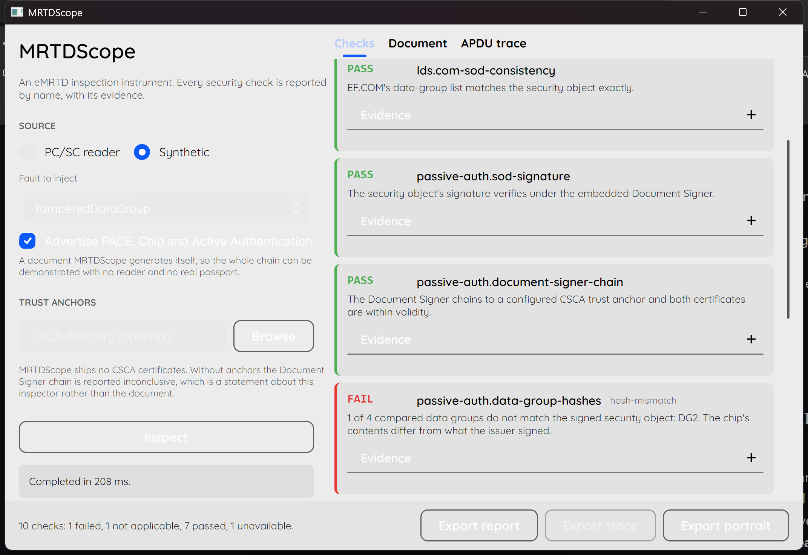
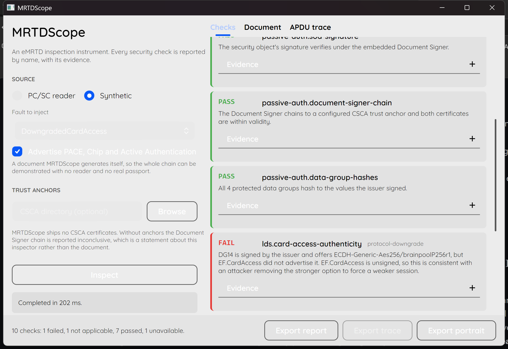

# MRTDScope

**A cross-platform eMRTD inspection instrument.** It reads an electronic passport over a PC/SC contactless reader or Android NFC, executes the ICAO Doc 9303 security protocols, and reports every security check as an individually named assertion with its outcome, reason, and evidence.

> **Status: the cryptographic core is complete and hardware-verified.** Access control (BAC and PACE), Passive Authentication, downgrade protection, Chip Authentication and Active Authentication all pass against a genuine passport, and eight forgery classes are rejected in CI on every commit. Desktop, CLI and Android surfaces are built; the Android head has not yet been run against a document on a handset. Run `mrtdscope capabilities` to see exactly what this build can and cannot do.



The portrait on this document was replaced after the issuer signed it. The signature is still valid and the certificate chain still builds — those checks pass, and say so. `passive-auth.data-group-hashes` is the one that fails, naming DG2. Three separate answers, not one verdict.

Every screenshot here is a document MRTDScope generated itself. No real passport was involved in any published artifact.

See it work without a reader or a passport:

```bash
dotnet run --project src/MRTDScope.Cli -- demo TamperedDataGroup
```

That runs the complete chain — SELECT, BAC, secure messaging, chunked reads, Passive Authentication — against a synthetic chip and prints the same report the screenshot shows, in a terminal, in about a second.

## Why another passport reader

There are two kinds of eMRTD tooling and neither is satisfying.

Commercial inspection products are closed and licensed. They return a verdict you cannot audit. Open implementations — JMRTD and the samples built on it — read the chip competently but stop at extraction; the published examples display a photo and a name, and their verification story is a boolean at best.

Neither kind demonstrates its own **rejection behavior**. No open reader ships evidence that it detects a tampered data group, a substituted Document Signer, an expired trust anchor, or a corrupted MAC.

A verification tool that has never been shown to reject anything is an assertion, not an instrument.

MRTDScope is built the other way around. Its differentiating deliverable is a synthetic eMRTD and a fault-injection corpus that prove, in CI on every commit, that the inspection chain detects each forgery class **and names the right failing check** — with no hardware and no real document data anywhere near the repository.

## Design rules

Three rules shape the codebase.

**No check reports success without performing it.** This is enforced by the type system, not by convention. `InspectionCheck` has no public constructor, and the only route to a passing result requires evidence:

```csharp
// Compiles, and throws: a check that observed nothing has verified nothing.
InspectionCheck.Passed(CheckIds.PassiveAuthSodSignature, "SOD signature verified.");

// The only way to pass.
InspectionCheck.Passed(
    CheckIds.PassiveAuthSodSignature,
    "SOD signature verified under the embedded Document Signer.",
    Evidence.Of("algorithm", "SHA256withRSA"),
    Evidence.Of("signer-serial", "0x2A17"));
```

**"Cannot verify" is not "verification failed."** Five statuses, deliberately: `Passed`, `Failed`, `Inconclusive`, `NotApplicable`, `Unavailable`. A missing trust anchor is `Inconclusive` — that is a statement about the inspector, not the document. Collapsing these into a boolean is how a tool stops being auditable and starts training its operator to ignore it.

**Passive Authentication means the data-group hashes too.** Verifying the SOD signature and chaining the Document Signer to a CSCA is not enough. Without hashing every data group read from the chip against the LDS Security Object, a substituted portrait passes silently. All three sub-checks are reported independently.

## What it verifies

Each check is documented in the [check reference](docs/checks.md): what it proves, and — more usefully — what it does not.

| Check | Status |
| --- | --- |
| Basic Access Control | **Implemented** — Doc 9303 Appendix D vectors reproduce exactly |
| AES secure messaging (CMAC, counter-derived IV) | **Implemented** |
| 3DES secure messaging | **Implemented** — all four APDU cases, short and extended |
| PC/SC transport | **Implemented** — Windows and Linux |
| LDS parsing — EF.COM, EF.SOD, DG1, DG2 | **Implemented** |
| Passive Authentication — SOD signature | **Implemented** |
| Passive Authentication — Document Signer chain | **Implemented** — absent anchor is inconclusive, not failure |
| Passive Authentication — data-group hashes | **Implemented** — detects a substituted portrait |
| EF.COM vs. security-object consistency | **Implemented** — catches content the issuer never signed |
| EF.CardAccess vs. DG14 | **Implemented** — catches a PACE protocol downgrade |
| Synthetic chip + fault corpus | **Implemented** — eight forgery classes, each asserted to fail the right check |
| PACE (Generic Mapping, ECDH, AES) | **Implemented** — hardware-verified against a real passport |
| Active Authentication (ISO/IEC 9796-2 DS1) | **Implemented** — message recovery, RSA and ECDSA |
| Chip Authentication | **Implemented** — restarts messaging on fresh keys |
| Terminal Authentication / EAC | **Never** — see below |

Every check above passes against a genuine passport on a PC/SC reader: nine checks, 173 APDUs, 5.3 seconds, with Extended Access Control reported `Unavailable` rather than omitted.

## What it does not do

These are boundaries, stated as plainly as the capabilities.

- **It never writes to a chip.** No personalization, no applet loading, no key injection, no locking. MRTDScope is read-only against real documents, permanently.
- **It is not forgery tooling.** Fault injection operates exclusively on synthetic documents MRTDScope generates itself, to prove detection.
- **It ships no trust anchors.** No CSCA certificates, no master list. Trust material is operator-supplied, and its absence is reported as `Inconclusive`.
- **No Extended Access Control.** Reading DG3 fingerprints requires a country-issued Inspection System certificate chain that this project cannot legitimately hold. The path reports `Unavailable` with a reason code. It is not stubbed as successful.
- **No iOS.** eMRTD reading on iOS needs a macOS build host and an Apple-granted NFC entitlement. A licensing and hardware wall, not an unfinished feature.
- **No revocation checking.** Neither CRL nor OCSP is implemented, so a Document Signer revoked after issue still chains successfully. The reason-code vocabulary carries no `certificate-revoked`, because declaring one would advertise a check that is not performed.
- **No biometric matching.** Portraits are extracted and displayed; there is no face comparison and no identity verification.
- **Not a certified conformance suite**, and no claim of accreditation.

## Downloading

Tagged releases carry self-contained binaries for Windows and Linux, x64. Download one, extract, run — no .NET runtime needed.

| Package | What it is |
| --- | --- |
| `mrtdscope-desktop-<rid>` | The desktop application. |
| `mrtdscope-cli-<rid>` | The command-line inspector. |

On Linux the desktop application needs the usual X11 client libraries, which a desktop install already has. The CLI needs `pcscd` running to reach a reader; the `demo` command needs neither.

## Building

Requires the [.NET 10 SDK](https://dotnet.microsoft.com/download).

```bash
dotnet build MRTDScope.slnx
```

```bash
dotnet test MRTDScope.slnx --filter "Category!=Hardware"
```

The full suite runs with no reader, no chip, and no network. Hardware-dependent tests are trait-gated and skipped by default; they require a PC/SC reader and a document you are entitled to read.

```bash
dotnet run --project src/MRTDScope.Cli -- capabilities
```

Run the desktop application:

```bash
dotnet run --project src/MRTDScope.Desktop
```

It reads over PC/SC, and it also inspects a synthetic document with any fault selected — so it can be demonstrated, screenshotted and taught with, with no reader and no real passport. To open straight onto one:

```bash
dotnet run --project src/MRTDScope.Desktop -- --demo DowngradedCardAccess --rich
```



That is the downgrade case, and it shows why the check has to exist: the signature, the certificate chain and every data-group hash pass, because the issuer's *signed* content is genuinely untouched. Only the comparison against the unsigned EF.CardAccess exposes it.

Inspect a physical document headlessly:

```bash
dotnet run --project src/MRTDScope.Cli -- inspect --doc L898902C --dob 690806 --doe 940623 --trust ./trust
```

Exit codes are the contract: `0` nothing failed, `1` a check failed, `2` the inspection could not be performed. A script that cannot tell "this document failed" from "no reader was attached" will eventually treat one as the other.

Add `--json`, `--text`, `--trace` or `--portrait` to write artifacts. Nothing is written unless a path is named: a real inspection produces the holder's portrait, MRZ and nationality, and a default output location would eventually leave those somewhere unintended. The portrait's extension follows the encoding rather than the request, because DG2 commonly holds JPEG 2000 and writing it as `.jpg` misreports what the document contains.

Hardware tests need a PC/SC reader and a document you are entitled to read. Set `MRTDSCOPE_TEST_DOC_NUMBER`, `MRTDSCOPE_TEST_DOB`, and `MRTDSCOPE_TEST_DOE`, then:

```bash
dotnet test MRTDScope.slnx --filter "Category=Hardware"
```

## Layout

| Path | Purpose |
| --- | --- |
| `src/MRTDScope.Core` | Protocols, LDS parsing, verification, report model. No UI, no transport library. |
| `src/MRTDScope.Pcsc` | The PC/SC transport, isolated so Core stays portable. |
| `src/MRTDScope.Synthetic` | An in-process eMRTD that speaks APDUs, plus the fault catalogue. |
| `src/MRTDScope.Android` | The Android NFC head. Outside the solution so the workload is not needed to build or test. |
| `src/MRTDScope.Desktop` | The desktop application. Avalonia 12, and the synthetic chip, so it demonstrates without a document. |
| `src/MRTDScope.Cli` | Headless inspection and report export. |
| `tests/MRTDScope.Core.Tests` | The full suite, including the fault corpus from M3. |
| `tests/MRTDScope.Desktop.Tests` | Headless Avalonia tests proving the window constructs and renders a report. |
| `docs/checks.md` | What each check proves, and what it does not. |

Everything above `ICardTransport` is transport-agnostic. PC/SC, Android NFC, and the synthetic chip of M3 are peers behind that one interface — which is what lets the fault corpus exercise the real protocol code byte for byte rather than a test double standing in for it. A test asserts Core references nothing but the framework and BouncyCastle, so the boundary cannot erode quietly.

The Android head keeps its risky logic in Core: retry, reconnect and tag-loss policy live in `ResilientTransport`, where the test suite reaches them, while `IsoDepTransport` only translates between `ICardTransport` and the platform API. That decorator sits *below* secure messaging — re-sending a protected APDU would desynchronise the send sequence counter and break every subsequent command, so a test asserts a full inspection survives a link that drops every command once.

## Downgrade protection

EF.CardAccess tells a terminal which access protocols a chip supports, and it is **unsigned** and readable before any authentication. An attacker who can present a modified one strips the strong PACE variant, leaving a weaker option the terminal then negotiates in good faith.

What makes that attack worth a dedicated check is that nothing else sees it. The weaker session is cryptographically sound, mutual authentication succeeds, and every Passive Authentication check passes — because the document's *signed* content is genuinely untouched. DG14 carries the same protocol information and is covered by the Document Security Object, so comparing the two is the only thing that exposes it:

```
"Id": "lds.card-access-authenticity",
"Status": "Failed",
"ReasonCode": "protocol-downgrade",
"Detail": "DG14 is signed by the issuer and offers ECDH-Generic-Aes256/brainpoolP256r1,
           but EF.CardAccess did not advertise it. EF.CardAccess is unsigned, so this is
           consistent with an attacker removing the stronger option to force a weaker
           session."
```

The check is retrospective by nature. It cannot prevent the downgrade — the session has already been negotiated by the time DG14 is readable — it reports that one occurred. ICAO Doc 9303 Part 11 requires an inspection system to perform it.

## The fault corpus

Each fault is a synthetic document built to fail one specific check, and each test asserts *which* check fails — not merely that something did. A verifier that rejects every bad document for the same reason is barely more useful than one that accepts them all, because an operator cannot act on it.

| Fault | Must fail | Everything else |
| --- | --- | --- |
| Tampered data group | `passive-auth.data-group-hashes`, naming the group | signature and chain still pass |
| Substituted document signer | `passive-auth.document-signer-chain` (`chain-not-trusted`) | its own signature is valid |
| Expired document signer | `passive-auth.document-signer-chain` (`certificate-expired`) | signature still valid |
| Corrupted SOD signature | `passive-auth.sod-signature` | — |
| Corrupted secure-messaging MAC | `secure-messaging.integrity`, mid-session | BAC itself completed |
| Replayed Active Authentication | `active-auth.challenge-response` | the signature is genuine, just stale |
| Unsigned data group | `lds.com-sod-consistency` | the hash check is structurally blind to it |
| Downgraded EF.CardAccess | `lds.card-access-authenticity` | PACE *and* every PA check pass |

The synthetic chip implements the *card* side of BAC and secure messaging behind the same `ICardTransport` interface as a real reader, so the production code path runs against it unmodified. It generates its own throwaway CSCA, so nothing it produces can chain to a real issuing authority — a genuine inspection system rejects it at the trust anchor, which is exactly what these tests assert.

The corpus is checked by mutation: disabling the data-group hash comparison fails precisely the four tests that should catch it, and no others.

## What the evidence actually rests on

Not every capability here is backed by the same strength of evidence, and the difference is worth stating.

- **BAC** is pinned byte-exact against the ICAO Doc 9303 Part 11 Appendix D worked example — every intermediate value, not just the outcome. That is evidence authored by the standards body.
- **Passive Authentication** is proven by the fault corpus: each forgery class must fail its own named check, verified by mutation testing.
- **PACE** has *no* published-vector coverage. The Doc 9303 worked example exists but its tables are too damaged in the available conversion to reconstruct the intermediate ephemeral keys. PACE's evidence is the independently written synthetic chip plus verification against a physical document — weaker than BAC's, and not presented as equivalent.

Two PACE defects were found by real hardware after CI was green: a conditional data object sent unconditionally, and the protocol attempted after application selection rather than before it. Both were cases where the synthetic chip was more permissive than a real one. A self-written chip validates the author's understanding of a protocol; it cannot validate that understanding. Each finding was fixed in the **model** as well as the terminal, so it fails in CI next time.

## Privacy

No real MRZ, chip dump, portrait, certificate, or key from any genuine document enters this repository, its history, its documentation, or any published artifact. Test PKI material is generated at run time and never committed. APDU traces redact secure-messaging key material.

## Licence

[MIT](LICENSE). MRTDScope vendors no third-party source and bundles no certificate or key material.
